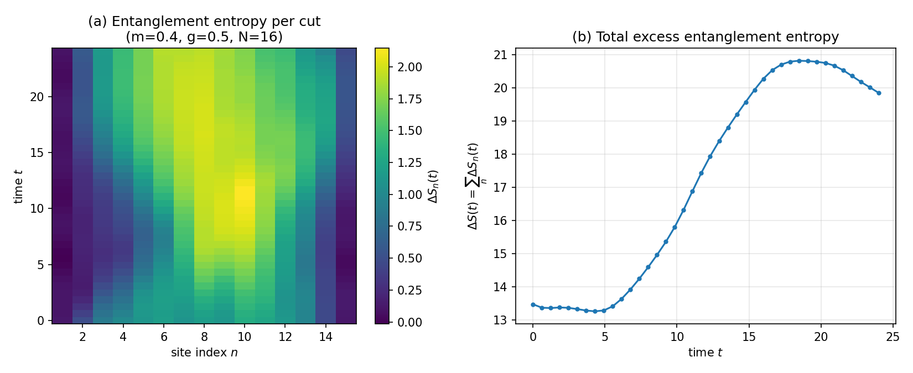

# Thirring Model Scattering: Entanglement Growth

A small, self-contained, exact-diagonalization reproduction of the
**entanglement-growth phenomenon** (Fig. 2) underlying:

> Y. Chai, J. Gibbs, V. R. Pascuzzi, Z. Holmes, S. Kühn, F. Tacchino, I. Tavernelli,
> **"Resource-Efficient Simulations of Particle Scattering on a Digital Quantum Computer"**,
> [arXiv:2507.17832](https://arxiv.org/abs/2507.17832) (2025)


*Entanglement entropy during fermion–antifermion scattering in the lattice Thirring
model (N=16, m=0.4, g=0.5). Left: excess entanglement entropy ΔS<sub>n</sub>(t) per
bipartition cut. Right: total excess entanglement ΔS(t) — flat before the collision,
rising sharply during it, exactly as reported in Fig. 2 of the paper above.*

## Table of contents

- [Motivation](#motivation)
- [What this repository does (and doesn't do)](#what-this-repository-does-and-doesnt-do)
- [Physics implemented](#physics-implemented)
- [Repository structure](#repository-structure)
- [Installation](#installation)
- [Quick start](#quick-start)
- [Running the tests](#running-the-tests)
- [Caveats and known finite-size effects](#caveats-and-known-finite-size-effects)
- [Extending this project](#extending-this-project)
- [References](#references)
- [License](#license)

## Motivation

The paper above develops a hybrid tensor-network / quantum-circuit method for
simulating particle scattering on near-term quantum hardware: the low-entanglement,
pre-collision dynamics is computed classically with matrix product states (MPS) and
compressed into a short quantum circuit, so that the quantum computer only needs to
handle the genuinely hard, high-entanglement post-collision regime.

The method only works because of one physical fact: **entanglement in the scattering
process stays low before the collision and grows sharply afterwards.** This repository
isolates and reproduces exactly that fact, from first principles, in a compact script
anyone can run on a laptop in a few seconds.

## What this repository does (and doesn't do)

**Does:**
- Builds the exact lattice Thirring model Hamiltonian used in the paper (Eq. 9).
- Constructs fermion/antifermion Gaussian wave packets from the free-theory momentum
  modes (Eq. 2–4, 6–7) and prepares the interacting scattering state (Eq. 5).
- Time-evolves the full statevector under the *interacting* Hamiltonian.
- Computes the bipartite entanglement entropy at every cut and every time step,
  reproducing the qualitative (and roughly quantitative) shape of Fig. 2 of the paper.
- Ships a small test suite that independently validates the implementation
  against an analytically known limit.

**Does not:**
- Use tensor networks (MPS/TEBD) or a quantum circuit. It uses plain **exact
  diagonalization** (full statevector simulation), which is the "ground truth" physics
  that the paper's tensor-network compression method is designed to reproduce
  *efficiently*, at scale. This keeps system sizes to N ≲ 20 on a laptop, vs. N = 40–80
  in the paper.
- Reproduce the paper's actual numerical method (Sec. III: MPS pre-computation +
  variational circuit compilation) or its hardware results (Sec. IV, IBM `ibm_fez`).
  See [Extending this project](#extending-this-project) for what that would take.

## Physics implemented

All equation numbers below refer to the paper.

| Step | What | Equation |
|---|---|---|
| 1 | Lattice Thirring Hamiltonian (Jordan–Wigner-transformed, open boundary conditions) | Eq. 9 |
| 2 | Interacting ground state `\|Ω⟩` via Lanczos diagonalization | — |
| 3 | Jordan–Wigner fermion operators `ξ_n†`, `ξ_n` | Eq. 8 |
| 4 | Free-theory momentum modes `c_k†`, `d_k†` (used only to define the wave packets) | Eq. 2–4 |
| 5 | Gaussian wave-packet momentum-space coefficients | Eq. 7 |
| 6 | Real-space wave-packet creation operators `C†`, `D†` (Eq. 2 combined with Eq. 6) | Eq. 6 |
| 7 | Scattering initial state `\|ψ₀⟩ = D†C†\|Ω⟩` | Eq. 5 |
| 8 | Time evolution under the full interacting `H` (Krylov / `expm_multiply`) | — |
| 9 | Bipartite von Neumann entanglement entropy, vacuum-subtracted | — |

## Repository structure

```
.
├── thirring_sim.py     # Core physics: Hamiltonian, JW operators, wave packets, entropy
├── run.py               # CLI entry point: runs the simulation and produces plots
├── tests/
│   └── test_physics.py  # Sanity checks (Hermiticity, norm, free-theory limit, entropy bounds)
├── figures/
│   └── example_output.png
├── results/              # Output of run.py (figures + raw .npz data), git-ignored
├── requirements.txt
├── LICENSE
└── README.md
```

## Installation

```bash
git clone <this-repo-url>
cd thirring-scattering-replication
python3 -m venv .venv && source .venv/bin/activate   # optional but recommended
pip install -r requirements.txt
```

Requires Python ≥ 3.10, `numpy`, `scipy`, `matplotlib`.

## Quick start

```bash
python run.py --N 16 --m 0.4 --g 0.5 --T 24 --steps 40
```

| flag | meaning | default |
|---|---|---|
| `--N` | number of qubits / lattice sites (must be a multiple of 4) | 16 |
| `--m` | fermion mass | 0.4 |
| `--g` | four-fermion coupling | 0.5 |
| `--T` | total evolution time | 24.0 |
| `--steps` | number of time-evolution snapshots | 40 |
| `--outdir` | output directory | `results` |

This produces `results/entanglement_growth_N{N}_m{m}_g{g}.png` — a two-panel figure
reproducing the structure of Fig. 2 of the paper — plus the raw data as a `.npz` file.

Runtime: a few seconds for N=16 on a laptop; N up to ~20–22 is feasible depending on
available RAM (Hilbert space dimension scales as 2^N).

Try different `(m, g)` pairs to see qualitatively different scattering outcomes
(transmission vs. reflection), analogous to the three cases shown in Fig. 8 of the
paper — e.g. `--g 0.7` produces a more strongly-interacting, more reflective collision.

## Running the tests

```bash
python tests/test_physics.py
# or, if you have pytest installed:
pytest tests/
```

The suite checks:
1. **Hermiticity** of the Hamiltonian for several parameter sets.
2. **Normalization** of the Lanczos ground state.
3. **Consistency with the free theory**: at `g=0`, the exact many-body vacuum energy
   is compared against the closed-form Dirac-sea result `E = -Σ_k w_k`, with an
   explicit check that the residual mismatch shrinks monotonically as `N` grows (see
   next section — this is a genuine finite-size effect, not a bug).
4. **Wave-packet normalization** sanity range.
5. **Entanglement entropy bounds** (a single-qubit cut can't exceed 1 bit).

## Caveats and known finite-size effects

- **Boundary condition mismatch (inherited from the paper itself):** the free-theory
  momentum modes used to *define* the wave packets are derived assuming periodic
  boundary conditions, while the Hamiltonian that is actually diagonalized and evolved
  uses open boundary conditions ("for simplicity", as in the paper). This is a good
  approximation once the wave packets are well-separated from each other and from the
  boundaries — the paper notes no significant boundary effects at N=40. In this
  repository's `test_free_theory_vacuum_energy` test, the residual mismatch shrinks
  monotonically with N (4.9% at N=8 → 2.7% at N=16), consistent with this being a
  genuine `1/N`-type finite-size artifact rather than an implementation bug.
- **Small system size**: N=16 by default vs. N=40–80 in the paper, purely a
  consequence of exact diagonalization's `2^N` scaling.

## Extending this project

Natural next steps, roughly in order of effort:

1. **Real MPS/TEBD simulation** (e.g. via [`quimb`](https://quimb.readthedocs.io/) or
   [`ITensorMPS.jl`](https://itensor.github.io/ITensors.jl/)) to reach system sizes
   closer to the paper's (N=40+), replacing exact diagonalization.
2. **Variational circuit compression** (paper Sec. III, App. A): given an MPS target
   state, find a short-depth brickwork circuit of SU(4) gates approximating it via
   Polar-Decomposition-based gate updates, and compare its depth against a standard
   Trotterized circuit — reproducing Fig. 3–5 of the paper.
3. **Hardware execution** of the compressed circuits via Qiskit on real IBM hardware
   (or a noisy simulator), with the error-mitigation stack used in the paper (ZNE,
   Pauli twirling, dynamical decoupling).

## References

- Y. Chai, J. Gibbs, V. R. Pascuzzi, Z. Holmes, S. Kühn, F. Tacchino, I. Tavernelli,
  *Resource-Efficient Simulations of Particle Scattering on a Digital Quantum Computer*,
  [arXiv:2507.17832](https://arxiv.org/abs/2507.17832) (2025).
- Y. Chai, A. Crippa, K. Jansen, S. Kühn, V. R. Pascuzzi, F. Tacchino, I. Tavernelli,
  *Fermionic wave packet scattering: a quantum computing approach*, Quantum **9**, 1638
  (2025), [arXiv:2312.02272](https://arxiv.org/abs/2312.02272) — the wave-packet
  construction (Eq. 2–8 above) is taken from this earlier paper by (mostly) the same
  authors.

## License

MIT — see [LICENSE](LICENSE).
